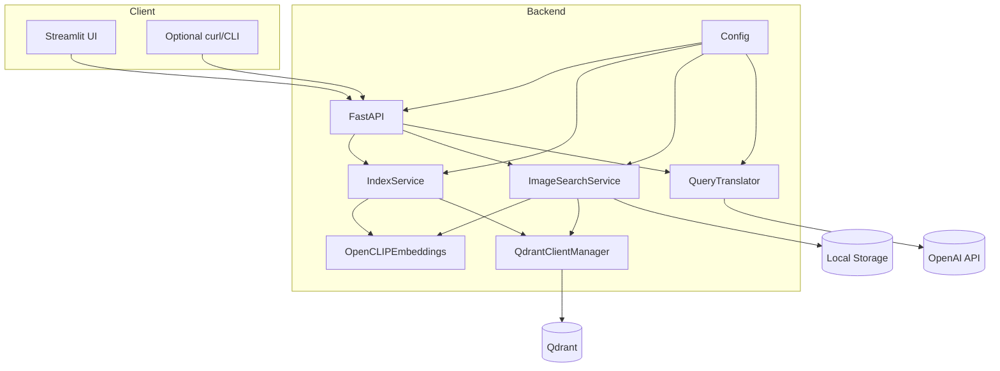
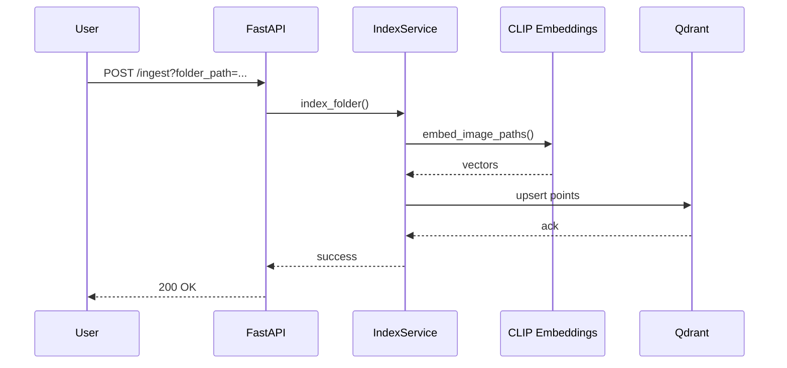
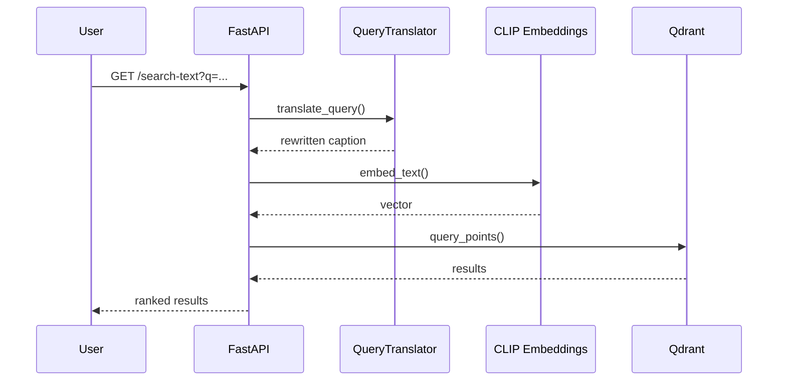
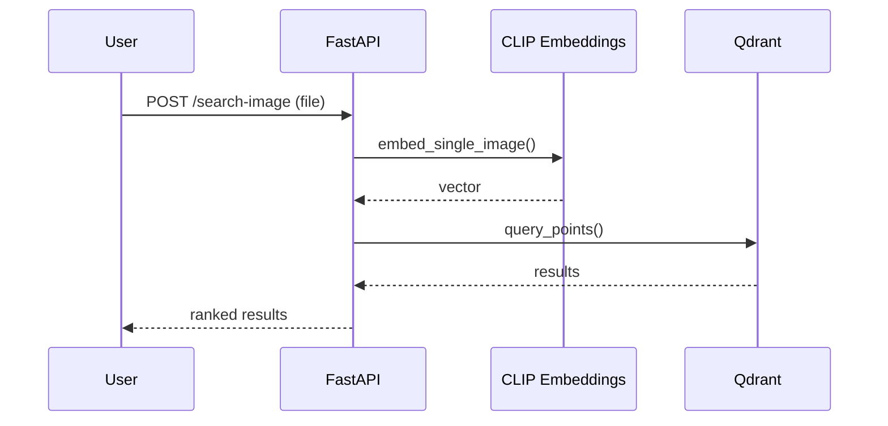
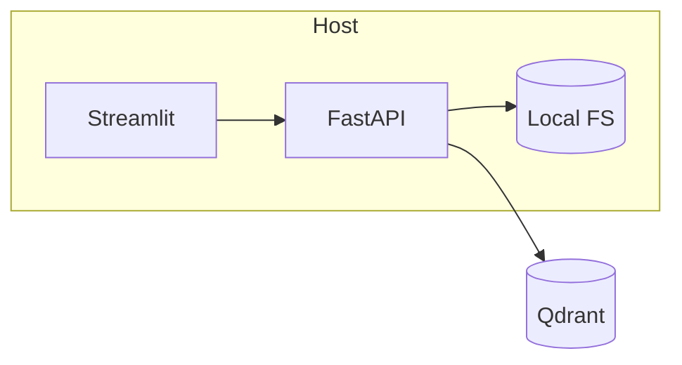

# Architecture (HLD)

## Overview
This project provides a multimodal semantic image search system with:
- A FastAPI backend for ingestion and search.
- A CLIP-based embedding layer for images and text.
- Qdrant as the vector database.
- An optional LLM query translator to rewrite user queries for better retrieval.
- A Streamlit UI for interactive search.

## Goals
- High-quality semantic retrieval for text-to-image and image-to-image queries.
- Clear modular separation between API, embeddings, vector store, and UI.
- Straightforward deployment with minimal configuration.

## Non-Goals
- Fine-tuning or training models.
- Managing large-scale distributed ingestion pipelines.

## System Context
```mermaid
flowchart LR
  User --> UI[Streamlit UI]
  User --> API[FastAPI API]
  UI --> API
  API --> Emb[Embedding Service (CLIP)]
  API --> Qdrant[(Qdrant Vector DB)]
  API --> FS[(Local Image Storage)]
  API --> LLM[Query Translator (OpenAI)]
```

## Component Diagram


## Data Flow - Ingestion


## Data Flow - Text Search


## Data Flow - Image Search


## Deployment View


## Key Decisions
- Qdrant as the vector store for efficient ANN search.
- OpenCLIP embeddings via LangChain for both text and image vectors.
- Query translation with a lightweight LLM to improve semantic alignment.

## Scalability Notes
- Use GPU for embeddings by setting `DEVICE=cuda`.
- Increase Qdrant resources and enable on-disk vectors.
- Add a background task queue for ingestion if indexing large datasets.

## Security & Privacy
- API keys are sourced from environment variables.
- No user authentication implemented by default.
- Uploaded images are stored locally under `data/query_images`.
