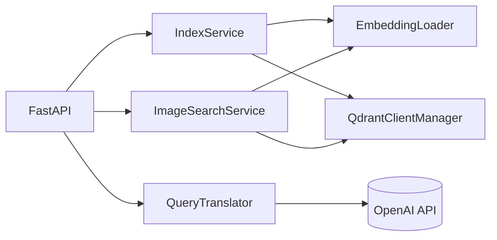
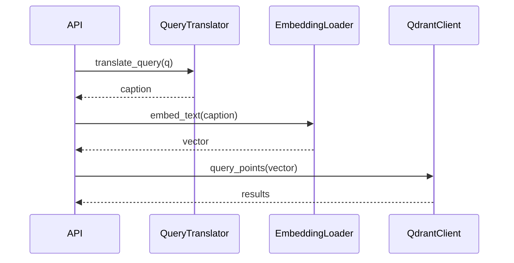

# Low-Level Design (LLD)

## Module Breakdown
```
semantic_image_search/
  backend/
    main.py                # FastAPI entrypoint
    ingestion.py           # IndexService
    retriever.py           # ImageSearchService
    embeddings.py          # EmbeddingLoader (OpenCLIP)
    query_translator.py    # QueryTranslator (OpenAI)
    qdrant_client.py       # QdrantClientManager
    config.py              # Env config, paths
    logger/                # Structured logging
    exception/             # Custom exception types
  ui/
    app.py                 # Streamlit UI
```

## Key Classes

### Config (`backend/config.py`)
- Loads `.env` at startup.
- Defines paths and all runtime environment values.
- Logs configuration for troubleshooting.

### QdrantClientManager (`backend/qdrant_client.py`)
- Singleton with lazy client initialization.
- Ensures the collection exists and configures vector size/distance.

### EmbeddingLoader (`backend/embeddings.py`)
- Wraps `OpenCLIPEmbeddings` from LangChain.
- Methods:
  - `embed_text(text: str) -> List[float]`
  - `embed_image(image_path: str) -> List[float]`
  - `embed_images(image_paths: List[str]) -> List[List[float]]`

### QueryTranslator (`backend/query_translator.py`)
- Uses OpenAI chat model to rewrite queries for CLIP retrieval.
- Exposed via `translate_query()` singleton.

### IndexService (`backend/ingestion.py`)
- Handles indexing for single image and folders.
- Creates a payload per image: `filename`, `path`, `category`.
- Stores vectors in Qdrant as point structs.

### ImageSearchService (`backend/retriever.py`)
- Searches using text or image embeddings.
- Optional metadata filtering by `category`.
- Can save retrieved images locally.

## API Endpoints

### `POST /ingest`
- Query params:
  - `folder_path` (optional): root folder to index; defaults to `IMAGES_ROOT`.
- Behavior:
  - Walks folders; category inferred from directory name.
  - Embeds and upserts into Qdrant.

### `GET /translate`
- Query params:
  - `q` (required): user query.
- Returns:
  - Translated caption string.

### `GET /search-text`
- Query params:
  - `q` (required): user query.
  - `k` (optional): top-k results, default 5.
  - `category` (optional): restrict to category.
  - `save_results` (optional): save to `data/retrieved/`.

### `POST /search-image`
- Form-data:
  - `file` (required): image file.
- Query params:
  - `k` (optional): top-k results, default 5.
  - `category` (optional): restrict to category.
  - `save_results` (optional): save to `data/retrieved/`.

## Data Model
Qdrant points include:
```
{
  id: uuid,
  vector: [float] * VECTOR_SIZE,
  payload: {
    filename: string,
    path: string,
    category: string
  }
}
```

## Error Handling
- Domain errors are wrapped in `SemanticImageSearchException`.
- API routes catch exceptions and return JSON error responses.

## Logging
- Structured logging via `semantic_image_search/backend/logger`.
- Each operation includes relevant context (paths, collection, counts).

## Diagrams

### Module Relationships


### Class Interaction - Text Search

